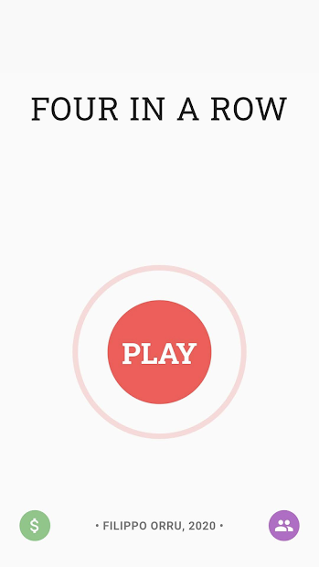
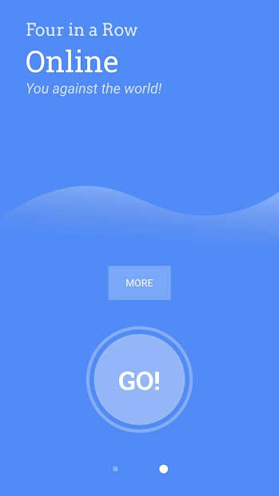

# Four in a Row - App

An **online** version of the popular game **four in a row**, written in Flutter + Dart on the client and Rust on the server side.

***Download here: https://play.google.com/store/apps/details?id=ml.fourinarow***

Or play online (beta): https://play.fourinarow.ml/

## Related Projects:
- Clientside: [fourinarow-app](https://github.com/ffactory-ofcl/fourinarow-app)

- Serverside: [fourinarow-server](https://github.com/ffactory-ofcl/fourinarow-server)

- \[WIP\] bot / watcher: [fourinarow-bot](https://github.com/ffactory-ofcl/fourinarow-bot)

## Features:
- world wide online play
- over 3000 downloads
- account creation, friends system
- beautiful, minimalist design
- subtle animations
- request to battle your friends
- local mode: two players - one device

### Under the hood:
- clean architecture: state and view completely separate
- reliable websocket connection
- automatic reconnection
- message delivery guarantee
- message reordering on client and server side

